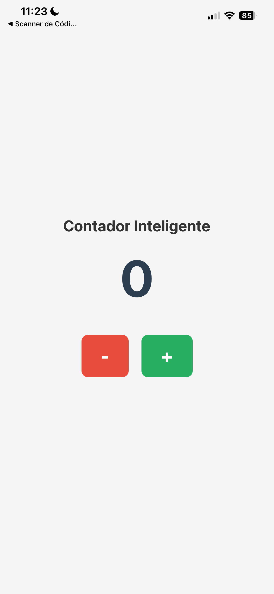

# Mobile Counter Application

A professional-grade, minimalist mobile counter designed for efficiency and seamless user interaction. This project focuses on clean state management and a responsive UI/UX.

## Overview

This repository contains a mobile application developed to provide a reliable and intuitive counting utility. It serves as a practical implementation of modern mobile development patterns, ensuring high performance and a clutter-free experience for the user.

## Key Features

* **Precise Counting:** Increment and decrement functionality with zero-latency.
* **Clean Architecture:** Modular code structure for easy scalability and maintenance.

## Tech Stack

* **Framework:** [React Native]
* **Language:** [JavaScript]

---

## Visual Showcase

Below you can find the visual representation of the application interface:

> **Note:** The following image displays the main dashboard and the core interaction flow of the counter.

---
Developed by [Fernando Santos Evencio da Silva]